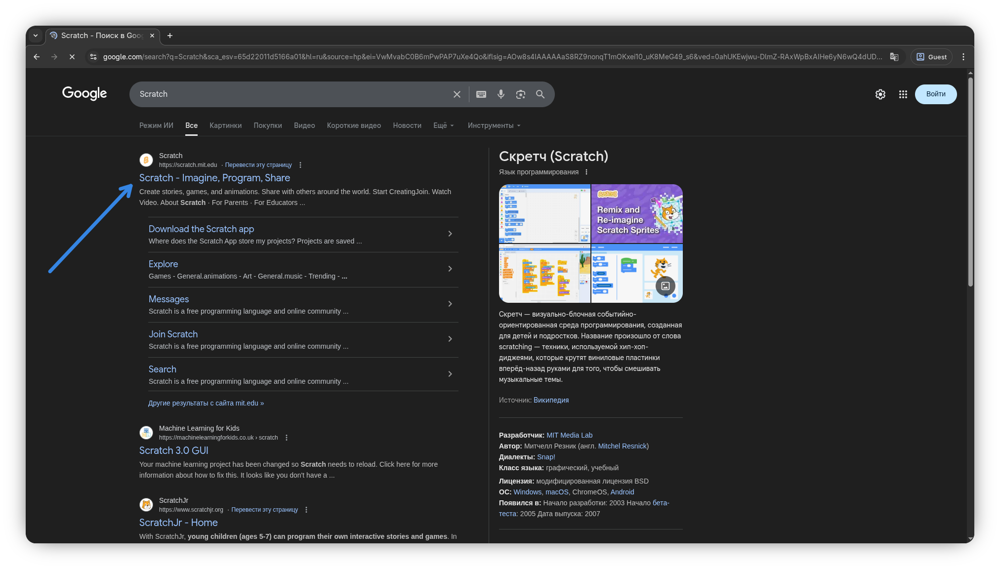
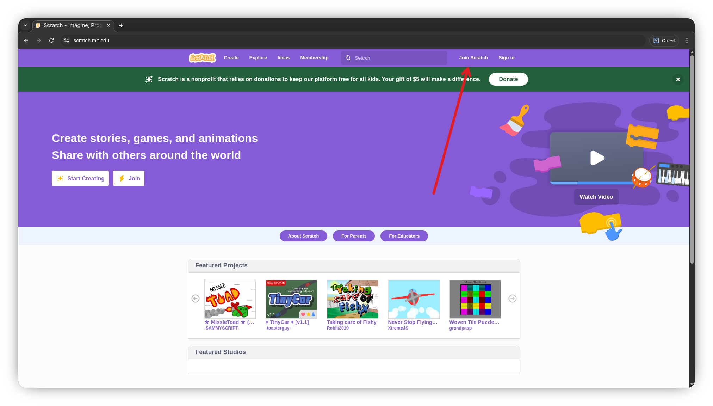
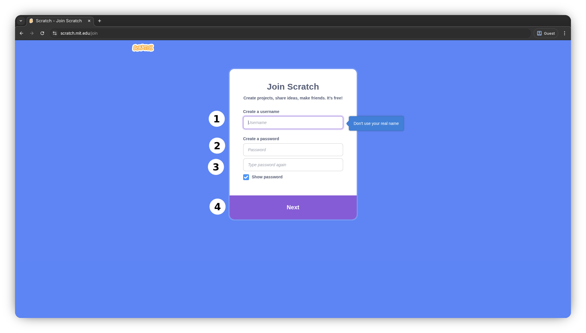
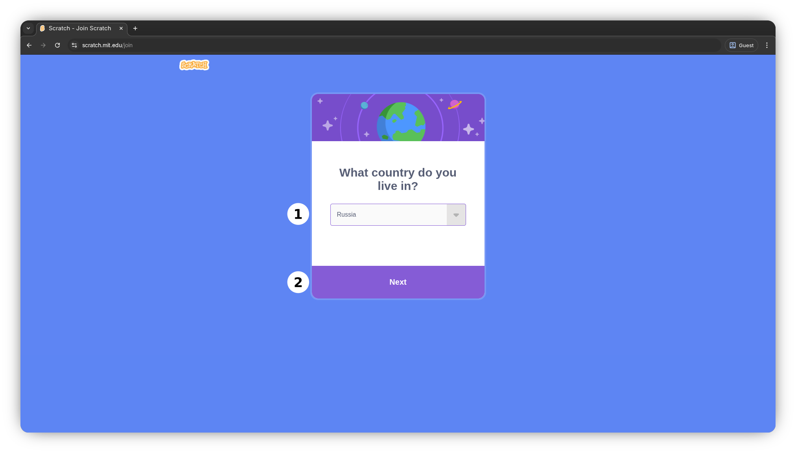
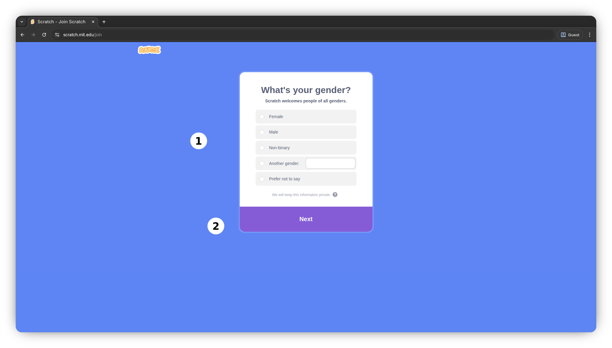
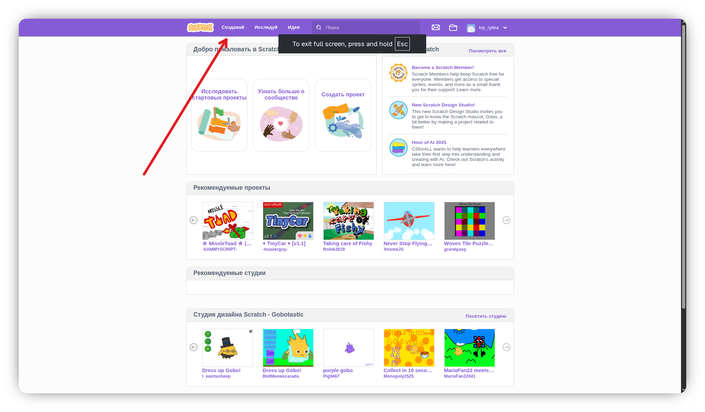

# 📝 Инструкция по созданию аккаунта Scratch

[Сайт Scratch](https://scratch.mit.edu/)

Обратите внимание, что для регистрации аккаунта может понадобиться включить VPN и выбрать другой регион.

<iframe width="720" height="405" src="https://rutube.ru/play/embed/79a8a45a1cc319b76374c19bc739dcb3/" style="border: none;" allow="clipboard-write; autoplay" webkitAllowFullScreen mozallowfullscreen allowFullScreen></iframe>